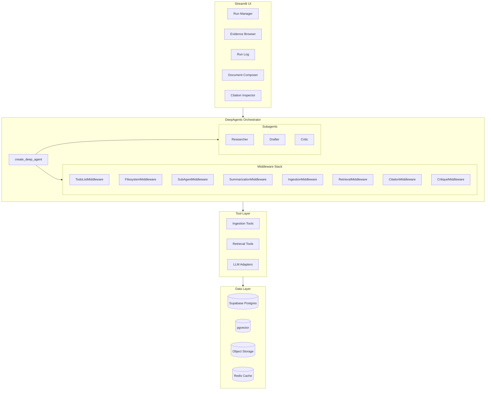
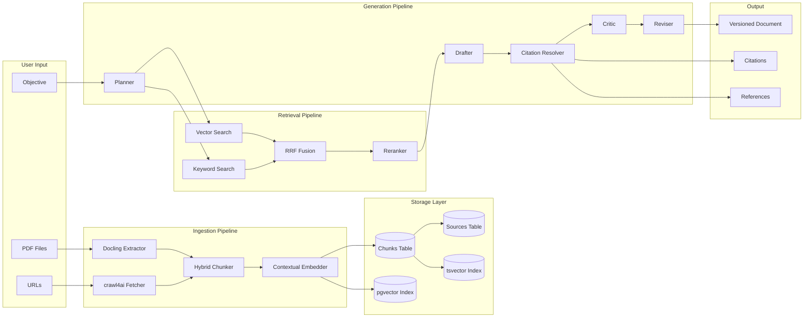
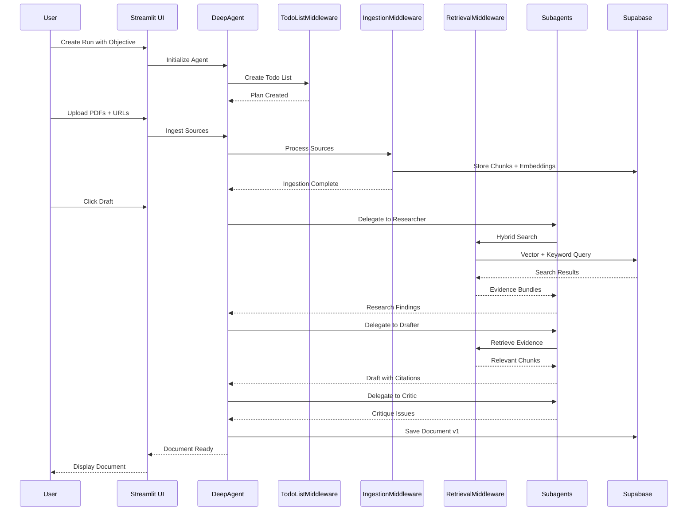
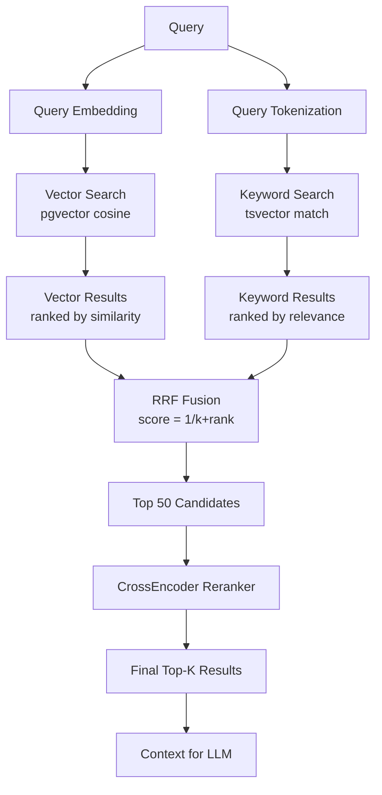
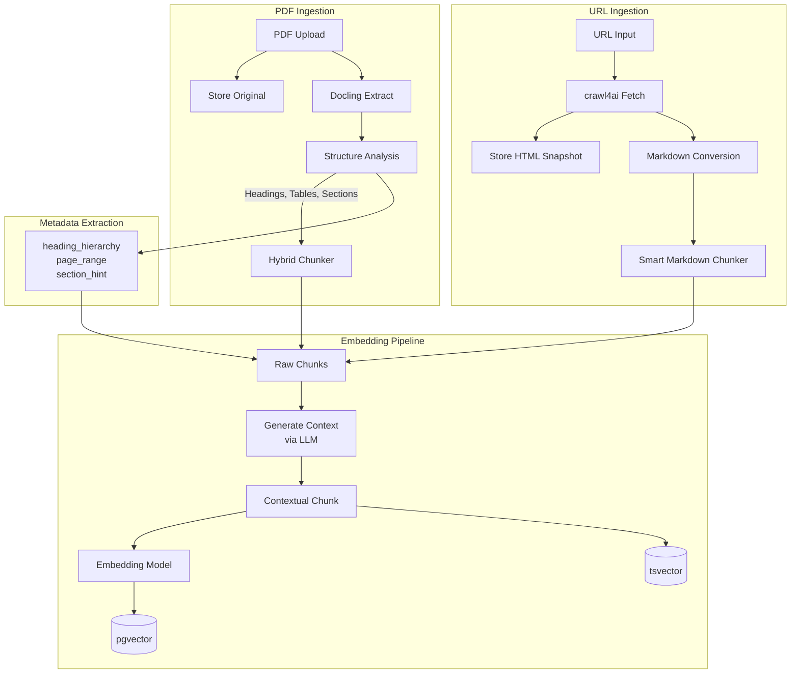
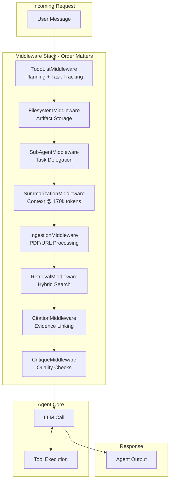

# PRD — DEEP_RESEARCH_APP (Streamlit MVP)

**Version:** 3.0  
**Owner:** Mike  
**Status:** Draft  
**Last Updated:** 2025-12-26

---

## 1. Executive Summary

DEEP_RESEARCH_APP is a Python-first research system that transforms messy inputs (research questions, constraints, PDFs, URLs, and prior agent outputs) into **versioned, reproducible, citation-backed research papers** (Markdown-first) using the **`deepagents` framework** with a lightweight **Streamlit MVP UI**.

### Key Design Decisions

This PRD consolidates insights from multiple analysis documents and makes the following architectural decisions:

1. **Build on `deepagents`**: Use `create_deep_agent()` as the foundation, leveraging built-in middleware (TodoListMiddleware, FilesystemMiddleware, SubAgentMiddleware, SummarizationMiddleware) rather than building custom LangGraph nodes from scratch.

2. **Hybrid Chunking**: Adopt structure-aware chunking using `DoclingHybridChunker` for PDFs and `crawl4ai` with `smart_chunk_markdown` for web content.

3. **Hybrid Search with RRF**: Implement Reciprocal Rank Fusion combining vector similarity and keyword search for robust retrieval.

4. **Contextual Embeddings**: Enhance chunk embeddings with LLM-generated context summaries for improved retrieval quality.

5. **Model Flexibility via LangChain**: Use LangChain's `init_chat_model()` for multi-provider support (Anthropic, OpenAI, Google, OpenRouter).

---

## 2. Goals & Success Criteria

### 2.1 Goals (MVP)

| # | Goal | Description |
|---|------|-------------|
| G1 | **Reproducible Research Runs** | Every run persists: inputs, plan, sources, chunks, prompts, outputs, citations |
| G2 | **Evidence-First Drafting** | Claims are tied to evidence or explicitly marked as assumptions |
| G3 | **PDF + URL Ingestion** | PDFs and URLs become searchable evidence with structure-aware chunking |
| G4 | **Hybrid Retrieval** | Combine semantic and keyword search with reranking for precision |
| G5 | **Usable MVP UI** | Streamlit two-pane view: run/chat log left, document composer right |
| G6 | **Versioned Output Artifacts** | Export Markdown with citations + references; store all versions |
| G7 | **Model Swap per Task** | Each pipeline stage can use a different model without code changes |

### 2.2 Success Criteria (Measurable)

| Metric | Target |
|--------|--------|
| End-to-end run | User can ingest ≥3 PDFs and ≥5 URLs, generate structured Markdown paper in one session |
| Citation coverage | ≥80% of factual/numeric claims linked to evidence snippets or labeled as assumptions |
| Version management | User can create V2 from V1 with documented change log and visible diff |
| Retrieval latency | <2 seconds for typical runs (<2k chunks) |
| Retrieval quality | Hybrid search returns relevant results for both semantic queries and exact keyword matches |
| Model swap | Switching drafter model requires only config change |
| Pipeline completion | <5 minutes for typical runs (<2k chunks) |
| Token efficiency | <100k tokens per run for drafting phase |

---

## 3. Non-Goals (MVP)

- No automatic bypass of paywalls or scraping against site ToS
- No fully-fledged collaborative editor (single-user MVP)
- No comprehensive "all formats" ingestion (start with PDF + URL; DOCX optional later)
- No complex browser automation by default (Playwright optional later)
- No hard dependency on n8n (optional integration post-MVP)
- No Claude Code CLI integration (focus on LangGraph patterns)

---

## 4. Users & Use Cases

### 4.1 Primary User

Technical operator writing business plans, feasibility studies, procurement documents, or technical research.

### 4.2 MVP Use Cases

| UC# | Use Case | Description |
|-----|----------|-------------|
| UC1 | Research Paper Generation | Upload PDFs and add URLs → ask for a research paper → get a cited Markdown draft |
| UC2 | Iterative Revision | Provide prior outputs (critique memo + old paper) → generate updated paper with change log |
| UC3 | Section-Level Revision | Ask follow-ups (e.g., "revise only Cost Model section") → regenerate section with new evidence |
| UC4 | Model Comparison | Compare multiple models/providers → pick best draft or merge |
| UC5 | Evidence Exploration | Browse ingested evidence, search across chunks, inspect provenance |

---

## 5. System Architecture

### 5.1 High-Level Architecture Diagram



### 5.2 Data Flow Diagram



### 5.3 Research Workflow Sequence



### 5.4 Hybrid Search Flow



### 5.5 Ingestion Pipeline Flow



### 5.6 Agent Middleware Stack



### 5.7 Architecture Summary

```
┌─────────────────────────────────────────────────────────────────────────────┐
│                              STREAMLIT UI                                    │
├─────────────────────────────────────────────────────────────────────────────┤
│  ┌─────────────────────┐  ┌─────────────────────────────────────────────┐   │
│  │   Left Pane         │  │   Right Pane                                │   │
│  │   - Run Manager     │  │   - Document Composer                       │   │
│  │   - Evidence List   │  │   - Markdown Preview/Editor                 │   │
│  │   - Run Log         │  │   - Diff View                               │   │
│  │   - Controls        │  │   - Citation Inspector                      │   │
│  │   - Model Config    │  │                                             │   │
│  └─────────────────────┘  └─────────────────────────────────────────────┘   │
└─────────────────────────────────────────────────────────────────────────────┘
                                      │
                                      ▼
┌─────────────────────────────────────────────────────────────────────────────┐
│                         DEEPAGENTS ORCHESTRATOR                              │
├─────────────────────────────────────────────────────────────────────────────┤
│  create_deep_agent()                                                         │
│  ├── TodoListMiddleware (planning)                                          │
│  ├── FilesystemMiddleware (artifacts)                                       │
│  ├── SubAgentMiddleware (delegation)                                        │
│  ├── SummarizationMiddleware (context management @ 170k tokens)             │
│  ├── IngestionMiddleware (custom - PDF/URL processing)                      │
│  ├── RetrievalMiddleware (custom - hybrid search)                           │
│  ├── CitationMiddleware (custom - evidence linking)                         │
│  └── CritiqueMiddleware (custom - quality checks)                           │
│                                                                              │
│  Subagents:                                                                  │
│  ├── researcher (web search, evidence gathering)                            │
│  ├── drafter (section writing with citations)                               │
│  └── critic (quality review, gap analysis)                                  │
└─────────────────────────────────────────────────────────────────────────────┘
                                      │
                                      ▼
┌─────────────────────────────────────────────────────────────────────────────┐
│                              TOOL LAYER                                      │
├─────────────────────────────────────────────────────────────────────────────┤
│  Ingestion Tools          │  Retrieval Tools        │  LLM Adapters         │
│  ├── pdf_ingest           │  ├── hybrid_search      │  ├── init_chat_model  │
│  ├── url_fetch            │  ├── rerank             │  └── embedding_client │
│  ├── docling_chunker      │  └── contextual_embed   │                       │
│  └── crawl4ai_chunker     │                         │                       │
└─────────────────────────────────────────────────────────────────────────────┘
                                      │
                                      ▼
┌─────────────────────────────────────────────────────────────────────────────┐
│                              DATA LAYER                                      │
├─────────────────────────────────────────────────────────────────────────────┤
│  Supabase Postgres        │  pgvector               │  Object Storage       │
│  ├── runs                 │  ├── chunk embeddings   │  ├── PDF originals    │
│  ├── sources              │  └── HNSW index         │  └── HTML snapshots   │
│  ├── chunks               │                         │                       │
│  ├── documents            │  Full-Text Search       │  Cache (optional)     │
│  ├── citations            │  └── tsvector index     │  └── Redis/diskcache  │
│  └── events               │                         │                       │
└─────────────────────────────────────────────────────────────────────────────┘
```

### 5.2 Deployment (MVP)

- Single-machine deployment (local or single server)
- Streamlit app + Python services
- Supabase hosted or self-hosted
- Environment variables for API keys and connections

---

## 6. Ingestion Strategy

### 6.1 PDF Ingestion

#### 6.1.1 Extraction Pipeline

```
PDF Upload → Docling Extraction → Hybrid Chunking → Contextual Embedding → pgvector Storage
```

#### 6.1.2 Docling Hybrid Chunker

Adopt the `DoclingHybridChunker` pattern from reference implementations:

```python
from docling.chunking import HybridChunker

class DoclingHybridChunker:
    """Structure-aware chunking that respects document semantics."""
    
    def __init__(
        self,
        max_tokens: int = 1000,
        overlap_tokens: int = 200,
        embedding_model: str = "text-embedding-3-small"
    ):
        self.max_tokens = max_tokens
        self.overlap_tokens = overlap_tokens
        self.tokenizer = tiktoken.encoding_for_model(embedding_model)
    
    def chunk(self, document: DoclingDocument) -> list[Chunk]:
        """
        Chunk document respecting:
        - Heading hierarchy
        - Section boundaries
        - Table integrity
        - Token limits
        """
        # Implementation leverages docling.chunking.HybridChunker
        pass
```

**Key Features:**
- Respects document structure (headings, sections, tables)
- Token-aware (fits embedding model limits)
- Preserves semantic boundaries
- Extracts heading hierarchy for metadata

#### 6.1.3 Fallback Strategy

```python
EXTRACTION_FALLBACKS = [
    ("docling", DoclingExtractor),      # Primary: structure-aware
    ("pypdf2", PyPDF2Extractor),        # Fallback: basic text
    ("ocr", TesseractExtractor),        # Last resort: image-based
]
```

### 6.2 URL Ingestion

#### 6.2.1 Extraction Pipeline

```
URL → crawl4ai Fetch → smart_chunk_markdown → Contextual Embedding → pgvector Storage
```

#### 6.2.2 crawl4ai Integration

Use `crawl4ai` for robust web content handling:

```python
from crawl4ai import AsyncWebCrawler

async def fetch_url(url: str) -> WebContent:
    """Fetch and process web content with crawl4ai."""
    async with AsyncWebCrawler() as crawler:
        result = await crawler.arun(url=url)
        return WebContent(
            url=url,
            title=result.title,
            markdown=result.markdown,
            captured_at=datetime.utcnow(),
            html_snapshot=result.html,
        )
```

#### 6.2.3 Smart Markdown Chunking

```python
def smart_chunk_markdown(
    markdown: str,
    max_tokens: int = 1000,
    overlap_tokens: int = 200
) -> list[Chunk]:
    """
    Chunk markdown respecting:
    - Code block integrity
    - Paragraph boundaries
    - Heading structure
    - List continuity
    """
    pass
```

### 6.3 Contextual Embeddings

Implement the "Contextual Embedding" pattern to improve retrieval quality:

```python
async def generate_contextual_embedding(
    chunk: Chunk,
    document_summary: str,
    llm: BaseChatModel
) -> Chunk:
    """
    Enhance chunk with contextual information before embedding.
    
    Example transformation:
    - Before: "The revenue grew by 5%"
    - After: "In Q3 2024, Company X's revenue grew by 5%, as reported in their quarterly earnings..."
    """
    prompt = f"""Given the following document summary and chunk, 
    situate the chunk within the overall document context.
    
    Document Summary: {document_summary}
    
    Chunk: {chunk.content}
    
    Provide a brief contextual prefix (1-2 sentences) that situates this chunk."""
    
    context = await llm.ainvoke(prompt)
    chunk.contextual_prefix = context.content
    chunk.embedding = await embed(f"{context.content}\n\n{chunk.content}")
    return chunk
```

### 6.4 Ingestion Configuration

```python
class IngestionConfig(BaseModel):
    """Configuration for ingestion pipeline."""
    
    # Chunking
    chunk_size_tokens: int = 1000
    chunk_overlap_tokens: int = 200
    chunking_strategy: Literal["hybrid", "simple", "semantic"] = "hybrid"
    
    # Embedding
    embedding_model: str = "text-embedding-3-small"
    embedding_dimensions: int = 1536
    use_contextual_embeddings: bool = True
    
    # Storage
    store_html_snapshots: bool = True
    store_pdf_originals: bool = True
```

---

## 7. Retrieval Strategy

### 7.1 Hybrid Search with RRF

Implement Reciprocal Rank Fusion combining vector and keyword search:

```python
class HybridSearcher:
    """Hybrid search combining vector similarity and keyword matching."""
    
    def __init__(
        self,
        vector_weight: float = 0.6,
        keyword_weight: float = 0.4,
        rrf_k: int = 60
    ):
        self.vector_weight = vector_weight
        self.keyword_weight = keyword_weight
        self.rrf_k = rrf_k
    
    async def search(
        self,
        query: str,
        run_id: UUID,
        top_k: int = 20
    ) -> list[SearchResult]:
        """
        Execute hybrid search with RRF fusion.
        
        1. Vector search via pgvector
        2. Keyword search via tsvector
        3. Merge with RRF: score = 1 / (k + rank)
        """
        # Parallel execution
        vector_results, keyword_results = await asyncio.gather(
            self._vector_search(query, run_id, top_k * 2),
            self._keyword_search(query, run_id, top_k * 2),
        )
        
        # RRF fusion
        return self._rrf_merge(vector_results, keyword_results, top_k)
    
    def _rrf_merge(
        self,
        vector_results: list[SearchResult],
        keyword_results: list[SearchResult],
        top_k: int
    ) -> list[SearchResult]:
        """Merge results using Reciprocal Rank Fusion."""
        scores = {}
        
        for rank, result in enumerate(vector_results):
            scores[result.chunk_id] = scores.get(result.chunk_id, 0) + \
                self.vector_weight * (1 / (self.rrf_k + rank + 1))
        
        for rank, result in enumerate(keyword_results):
            scores[result.chunk_id] = scores.get(result.chunk_id, 0) + \
                self.keyword_weight * (1 / (self.rrf_k + rank + 1))
        
        # Sort by combined score and return top_k
        sorted_ids = sorted(scores.keys(), key=lambda x: scores[x], reverse=True)
        return [self._get_result(id) for id in sorted_ids[:top_k]]
```

### 7.2 Reranking (Optional but Recommended)

Add a reranking step for precision-critical research:

```python
from sentence_transformers import CrossEncoder

class Reranker:
    """Rerank search results using cross-encoder."""
    
    def __init__(self, model_name: str = "ms-marco-MiniLM-L-6-v2"):
        self.model = CrossEncoder(model_name)
    
    def rerank(
        self,
        query: str,
        results: list[SearchResult],
        top_k: int = 10
    ) -> list[SearchResult]:
        """Rerank top-50 results to select final top-k."""
        pairs = [(query, r.content) for r in results]
        scores = self.model.predict(pairs)
        
        ranked = sorted(
            zip(results, scores),
            key=lambda x: x[1],
            reverse=True
        )
        return [r for r, _ in ranked[:top_k]]
```

### 7.3 Retrieval Configuration

```python
class RetrievalConfig(BaseModel):
    """Configuration for retrieval pipeline."""
    
    # Search
    search_type: Literal["hybrid", "vector", "keyword"] = "hybrid"
    vector_weight: float = 0.6
    keyword_weight: float = 0.4
    rrf_k: int = 60
    
    # Results
    initial_top_k: int = 50  # Before reranking
    final_top_k: int = 10    # After reranking
    
    # Reranking
    use_reranking: bool = True
    reranker_model: str = "ms-marco-MiniLM-L-6-v2"
    
    # Query expansion
    use_query_expansion: bool = False
    expansion_model: str | None = None
```

---

## 8. Data Model

### 8.1 Database Schema

```sql
-- Runs table
CREATE TABLE runs (
    id UUID PRIMARY KEY DEFAULT gen_random_uuid(),
    title TEXT NOT NULL,
    objective TEXT NOT NULL,
    constraints JSONB DEFAULT '{}',
    created_at TIMESTAMPTZ DEFAULT NOW(),
    updated_at TIMESTAMPTZ DEFAULT NOW(),
    status TEXT CHECK (status IN ('created', 'ingesting', 'drafting', 'reviewing', 'complete', 'error')) DEFAULT 'created',
    config JSONB NOT NULL  -- RunConfig Pydantic snapshot
);

-- Sources table
CREATE TABLE sources (
    id UUID PRIMARY KEY DEFAULT gen_random_uuid(),
    run_id UUID REFERENCES runs(id) ON DELETE CASCADE,
    type TEXT CHECK (type IN ('pdf', 'url', 'note')) NOT NULL,
    title TEXT NOT NULL,
    uri TEXT NOT NULL,  -- URL or storage path
    captured_at TIMESTAMPTZ DEFAULT NOW(),
    content_hash TEXT NOT NULL,
    metadata JSONB DEFAULT '{}'
);

-- Chunks table (enhanced for hybrid search)
CREATE TABLE chunks (
    id UUID PRIMARY KEY DEFAULT gen_random_uuid(),
    source_id UUID REFERENCES sources(id) ON DELETE CASCADE,
    run_id UUID REFERENCES runs(id) ON DELETE CASCADE,
    chunk_index INT NOT NULL,
    content TEXT NOT NULL,
    contextual_prefix TEXT,  -- From contextual embedding
    page_start INT,
    page_end INT,
    section_hint TEXT,
    heading_hierarchy TEXT[],  -- From Docling structure
    content_hash TEXT NOT NULL,
    token_count INT NOT NULL,
    chunk_method TEXT NOT NULL,  -- 'hybrid', 'simple', etc.
    embedding VECTOR(1536),
    search_content TSVECTOR,  -- For hybrid search
    metadata JSONB DEFAULT '{}'
);

-- Create indexes for hybrid search
CREATE INDEX chunks_embedding_idx ON chunks 
    USING hnsw (embedding vector_cosine_ops)
    WITH (m = 16, ef_construction = 64);

CREATE INDEX chunks_search_idx ON chunks 
    USING gin (search_content);

CREATE INDEX chunks_run_id_idx ON chunks (run_id);

-- Documents table
CREATE TABLE documents (
    id UUID PRIMARY KEY DEFAULT gen_random_uuid(),
    run_id UUID REFERENCES runs(id) ON DELETE CASCADE,
    version INT NOT NULL,
    title TEXT NOT NULL,
    markdown TEXT NOT NULL,
    created_at TIMESTAMPTZ DEFAULT NOW(),
    change_log TEXT,
    config_snapshot JSONB NOT NULL,  -- RunConfig at time of generation
    UNIQUE (run_id, version)
);

-- Citations table
CREATE TABLE citations (
    id UUID PRIMARY KEY DEFAULT gen_random_uuid(),
    document_id UUID REFERENCES documents(id) ON DELETE CASCADE,
    citation_key TEXT NOT NULL,  -- [1], [2], etc.
    source_id UUID REFERENCES sources(id),
    reference_entry TEXT NOT NULL,
    anchors JSONB NOT NULL  -- [{chunk_id, page, quote_start, quote_end}]
);

-- Events table (observability)
CREATE TABLE events (
    id UUID PRIMARY KEY DEFAULT gen_random_uuid(),
    run_id UUID REFERENCES runs(id) ON DELETE CASCADE,
    ts TIMESTAMPTZ DEFAULT NOW(),
    type TEXT CHECK (type IN ('node_start', 'node_end', 'tool_call', 'error', 'checkpoint')) NOT NULL,
    node_name TEXT,
    payload JSONB DEFAULT '{}'
);

-- Trigger to update search_content
CREATE OR REPLACE FUNCTION update_search_content()
RETURNS TRIGGER AS $$
BEGIN
    NEW.search_content := to_tsvector('english', COALESCE(NEW.contextual_prefix, '') || ' ' || NEW.content);
    RETURN NEW;
END;
$$ LANGUAGE plpgsql;

CREATE TRIGGER chunks_search_content_trigger
    BEFORE INSERT OR UPDATE ON chunks
    FOR EACH ROW
    EXECUTE FUNCTION update_search_content();
```

### 8.2 Pydantic Models

```python
from pydantic import BaseModel, Field
from typing import Literal
from datetime import datetime
from uuid import UUID

class ModelConfig(BaseModel):
    """Per-stage model configuration."""
    planner: str = "anthropic:claude-sonnet-4-5-20250929"
    drafter: str = "anthropic:claude-sonnet-4-5-20250929"
    critic: str = "anthropic:claude-sonnet-4-5-20250929"
    embedder: str = "text-embedding-3-small"

class RunConfig(BaseModel):
    """Configuration for a research run."""
    title: str
    objective: str
    constraints: dict[str, str] = Field(default_factory=dict)
    output_format: Literal["markdown"] = "markdown"
    citation_style: Literal["numeric", "author-date"] = "numeric"
    models: ModelConfig = Field(default_factory=ModelConfig)
    ingestion: IngestionConfig = Field(default_factory=IngestionConfig)
    retrieval: RetrievalConfig = Field(default_factory=RetrievalConfig)

class Source(BaseModel):
    """A source document (PDF, URL, or note)."""
    id: UUID
    run_id: UUID
    type: Literal["pdf", "url", "note"]
    title: str
    uri: str
    captured_at: datetime
    content_hash: str
    metadata: dict = Field(default_factory=dict)

class Chunk(BaseModel):
    """A chunk of evidence from a source."""
    id: UUID
    source_id: UUID
    run_id: UUID
    chunk_index: int
    content: str
    contextual_prefix: str | None = None
    page_start: int | None = None
    page_end: int | None = None
    section_hint: str | None = None
    heading_hierarchy: list[str] = Field(default_factory=list)
    content_hash: str
    token_count: int
    chunk_method: str
    embedding: list[float] | None = None
    metadata: dict = Field(default_factory=dict)

class SearchResult(BaseModel):
    """A search result with provenance."""
    chunk_id: UUID
    source_id: UUID
    content: str
    contextual_prefix: str | None = None
    page_start: int | None = None
    page_end: int | None = None
    section_hint: str | None = None
    score: float
    source_title: str
    source_uri: str

class Citation(BaseModel):
    """A citation linking a claim to evidence."""
    id: UUID
    document_id: UUID
    citation_key: str  # [1], [2], etc.
    source_id: UUID
    reference_entry: str
    anchors: list[dict]  # [{chunk_id, page, quote_start, quote_end}]

class Document(BaseModel):
    """A versioned research document."""
    id: UUID
    run_id: UUID
    version: int
    title: str
    markdown: str
    created_at: datetime
    change_log: str | None = None
    config_snapshot: RunConfig

class CritiqueIssue(BaseModel):
    """An issue identified during critique."""
    type: Literal["missing_citation", "weak_claim", "math_error", "contradiction", "unsupported"]
    severity: Literal["error", "warning", "info"]
    location: str  # Section or line reference
    description: str
    suggestion: str | None = None
```

---

## 9. Agent Architecture

### 9.1 Main Agent Configuration

```python
from deepagents import create_deep_agent
from langchain.chat_models import init_chat_model

def create_research_agent(config: RunConfig) -> CompiledStateGraph:
    """Create the main research agent using deepagents."""
    
    model = init_chat_model(config.models.planner, temperature=0.0)
    
    # Custom tools for research
    tools = [
        pdf_ingest_tool,
        url_fetch_tool,
        hybrid_search_tool,
        citation_format_tool,
        think_tool,
    ]
    
    # Custom middleware
    middleware = [
        IngestionMiddleware(config.ingestion),
        RetrievalMiddleware(config.retrieval),
        CitationMiddleware(config.citation_style),
        CritiqueMiddleware(),
    ]
    
    # Subagents
    subagents = [
        {
            "name": "researcher",
            "description": "Delegate research tasks to gather evidence on specific topics.",
            "system_prompt": RESEARCHER_PROMPT,
            "tools": [tavily_search, think_tool],
            "model": config.models.drafter,
        },
        {
            "name": "drafter",
            "description": "Delegate section drafting with evidence-based writing.",
            "system_prompt": DRAFTER_PROMPT,
            "tools": [hybrid_search_tool, citation_format_tool],
            "model": config.models.drafter,
        },
        {
            "name": "critic",
            "description": "Delegate quality review and gap analysis.",
            "system_prompt": CRITIC_PROMPT,
            "tools": [hybrid_search_tool],
            "model": config.models.critic,
        },
    ]
    
    return create_deep_agent(
        model=model,
        tools=tools,
        system_prompt=ORCHESTRATOR_PROMPT,
        middleware=middleware,
        subagents=subagents,
        checkpointer=PostgresSaver(connection_string),
    )
```

### 9.2 Research Workflow

The agent follows this workflow (managed by TodoListMiddleware):

```
1. Plan
   └── Create todo list breaking down research into focused tasks
   └── Save research request to /research_request.md

2. Ingest
   └── Process uploaded PDFs with DoclingHybridChunker
   └── Fetch URLs with crawl4ai
   └── Generate contextual embeddings
   └── Store chunks in pgvector

3. Research
   └── Delegate to researcher subagent(s)
   └── Gather evidence via hybrid search
   └── Consolidate findings with citations

4. Draft
   └── Delegate section drafting to drafter subagent
   └── Write with inline citation placeholders
   └── Link claims to evidence chunks

5. Cite
   └── Resolve citation placeholders to numbered references
   └── Generate IEEE-style reference list
   └── Validate all claims have evidence or assumption labels

6. Critique
   └── Delegate to critic subagent
   └── Check for missing citations, weak claims, contradictions
   └── Generate issues list with suggestions

7. Revise (if needed)
   └── Address critique issues
   └── Add new evidence if required
   └── Generate V2 with change log

8. Publish
   └── Save final document to /final_report.md
   └── Persist to documents table
   └── Store citations and version metadata
```

### 9.3 Middleware Specifications

#### IngestionMiddleware

```python
class IngestionMiddleware(AgentMiddleware):
    """Middleware for PDF and URL ingestion."""
    
    tools = [pdf_ingest_tool, url_fetch_tool]
    
    def __init__(self, config: IngestionConfig):
        self.config = config
        self.pdf_chunker = DoclingHybridChunker(
            max_tokens=config.chunk_size_tokens,
            overlap_tokens=config.chunk_overlap_tokens,
        )
        self.url_chunker = SmartMarkdownChunker(
            max_tokens=config.chunk_size_tokens,
            overlap_tokens=config.chunk_overlap_tokens,
        )
```

#### RetrievalMiddleware

```python
class RetrievalMiddleware(AgentMiddleware):
    """Middleware for hybrid search and retrieval."""
    
    tools = [hybrid_search_tool, rerank_tool]
    
    def __init__(self, config: RetrievalConfig):
        self.config = config
        self.searcher = HybridSearcher(
            vector_weight=config.vector_weight,
            keyword_weight=config.keyword_weight,
            rrf_k=config.rrf_k,
        )
        if config.use_reranking:
            self.reranker = Reranker(config.reranker_model)
```

#### CitationMiddleware

```python
class CitationMiddleware(AgentMiddleware):
    """Middleware for citation management."""
    
    tools = [citation_format_tool, validate_citations_tool]
    
    def __init__(self, style: Literal["numeric", "author-date"] = "numeric"):
        self.style = style
        self.citation_map: dict[str, Citation] = {}
```

#### CritiqueMiddleware

```python
class CritiqueMiddleware(AgentMiddleware):
    """Middleware for quality critique."""
    
    tools = [critique_tool, validate_math_tool]
    
    def critique(self, document: Document, citations: list[Citation]) -> list[CritiqueIssue]:
        """Run critique checks on document."""
        issues = []
        issues.extend(self._check_missing_citations(document, citations))
        issues.extend(self._check_weak_claims(document))
        issues.extend(self._check_math_consistency(document))
        issues.extend(self._check_contradictions(document))
        return issues
```

---

## 10. LLM Layer

### 10.1 Model Initialization

Use LangChain's `init_chat_model()` for multi-provider support:

```python
from langchain.chat_models import init_chat_model

# Anthropic
model = init_chat_model("anthropic:claude-sonnet-4-5-20250929", temperature=0.0)

# OpenAI
model = init_chat_model("openai:gpt-4o", temperature=0.0)

# Google
model = init_chat_model("google:gemini-pro", temperature=0.0)

# OpenRouter (for additional models)
model = init_chat_model("openrouter:anthropic/claude-3-opus", temperature=0.0)
```

### 10.2 Embedding Client

```python
class EmbeddingClient:
    """Unified embedding client with provider abstraction."""
    
    def __init__(self, model: str = "text-embedding-3-small"):
        self.model = model
        self._client = self._init_client(model)
    
    async def embed(self, texts: list[str]) -> list[list[float]]:
        """Embed texts with batching and rate limiting."""
        pass
    
    async def embed_query(self, query: str) -> list[float]:
        """Embed a single query."""
        return (await self.embed([query]))[0]
```

### 10.3 Model Configuration

```python
class ModelConfig(BaseModel):
    """Per-stage model configuration."""
    
    # Planning and orchestration
    planner: str = "anthropic:claude-sonnet-4-5-20250929"
    
    # Content generation
    drafter: str = "anthropic:claude-sonnet-4-5-20250929"
    
    # Quality review
    critic: str = "anthropic:claude-sonnet-4-5-20250929"
    
    # Embeddings
    embedder: str = "text-embedding-3-small"
    
    # Optional: contextual embedding summarizer
    contextualizer: str | None = "anthropic:claude-haiku-3"
```

---

## 11. Streamlit UI

### 11.1 Layout

```
┌─────────────────────────────────────────────────────────────────────────────┐
│  DEEP RESEARCH APP                                            [Settings] ⚙️  │
├─────────────────────────────────────────────────────────────────────────────┤
│  ┌─────────────────────┐  ┌─────────────────────────────────────────────┐   │
│  │ 📁 Runs             │  │ 📄 Document Composer                        │   │
│  │ ├── Run 1 ✓         │  │                                             │   │
│  │ ├── Run 2 (active)  │  │ [Preview] [Edit] [Diff]                     │   │
│  │ └── + New Run       │  │ ─────────────────────────────────────────── │   │
│  │                     │  │                                             │   │
│  │ 📎 Evidence         │  │ # Research Report v2                        │   │
│  │ ├── paper.pdf (3p)  │  │                                             │   │
│  │ ├── article.url     │  │ ## Introduction                             │   │
│  │ └── + Add Source    │  │ The market analysis shows [1] that...       │   │
│  │                     │  │                                             │   │
│  │ 📋 Run Log          │  │ ## Findings                                 │   │
│  │ ├── ✓ Plan created  │  │ According to recent studies [2], the...     │   │
│  │ ├── ✓ 3 PDFs indexed│  │                                             │   │
│  │ ├── ⏳ Drafting...  │  │ [Click [1] to see evidence]                 │   │
│  │ └── ...             │  │                                             │   │
│  │                     │  │ ─────────────────────────────────────────── │   │
│  │ 🎛️ Controls         │  │ 📌 Citation Inspector                       │   │
│  │ [Ingest] [Draft]    │  │ [1] paper.pdf, p.12                         │   │
│  │ [Critique] [Revise] │  │ "The revenue grew by 5% in Q3..."           │   │
│  │ [Export]            │  │                                             │   │
│  │                     │  │                                             │   │
│  │ ⚙️ Model Config     │  │                                             │   │
│  │ Planner: claude-4.5 │  │                                             │   │
│  │ Drafter: claude-4.5 │  │                                             │   │
│  │ Critic:  claude-4.5 │  │                                             │   │
│  └─────────────────────┘  └─────────────────────────────────────────────┘   │
└─────────────────────────────────────────────────────────────────────────────┘
```

### 11.2 State Management

```python
# Session state structure
class StreamlitState(BaseModel):
    """Streamlit session state schema."""
    
    current_run_id: UUID | None = None
    pipeline_status: Literal["idle", "running", "complete", "error"] = "idle"
    agent_graph: CompiledStateGraph | None = None
    checkpointer: PostgresSaver | None = None
    
    # UI state
    active_tab: Literal["preview", "edit", "diff"] = "preview"
    selected_citation: str | None = None
    log_filter: Literal["all", "errors", "tools"] = "all"

# Initialize session state
if "state" not in st.session_state:
    st.session_state.state = StreamlitState()
```

### 11.3 Real-Time Progress

```python
async def run_pipeline_with_progress(run_id: UUID, config: RunConfig):
    """Execute pipeline with real-time progress updates."""
    
    progress_placeholder = st.empty()
    log_placeholder = st.empty()
    
    agent = create_research_agent(config)
    
    async for event in agent.astream_events(
        {"messages": [HumanMessage(content=config.objective)]},
        config={"run_id": str(run_id)},
    ):
        if event["event"] == "on_chain_start":
            progress_placeholder.progress(
                event.get("progress", 0),
                text=f"Running: {event.get('name', 'unknown')}"
            )
        
        if event["event"] == "on_tool_end":
            log_placeholder.write(f"✓ {event['name']}: {event.get('output', '')[:100]}...")
```

### 11.4 Citation Inspector

```python
def render_citation_inspector(citation_key: str, citations: list[Citation]):
    """Render citation details in sidebar."""
    
    citation = next((c for c in citations if c.citation_key == citation_key), None)
    if not citation:
        st.warning(f"Citation {citation_key} not found")
        return
    
    st.subheader(f"Citation {citation_key}")
    st.write(f"**Source:** {citation.reference_entry}")
    
    for anchor in citation.anchors:
        chunk = get_chunk(anchor["chunk_id"])
        st.markdown(f"""
        **Page {anchor.get('page', 'N/A')}**
        > {chunk.content}
        """)
```

---

## 12. Error Handling & Recovery

### 12.1 Ingestion Errors

```python
class IngestionError(Exception):
    """Base class for ingestion errors."""
    pass

class PDFExtractionError(IngestionError):
    """PDF extraction failed."""
    fallback_attempted: bool = False

class URLFetchError(IngestionError):
    """URL fetch failed."""
    status_code: int | None = None
    retry_count: int = 0

# Retry configuration
INGESTION_RETRY_CONFIG = {
    "max_retries": 3,
    "backoff_factor": 2.0,
    "retry_on": [URLFetchError, TimeoutError],
}
```

### 12.2 Pipeline Recovery

```python
async def resume_pipeline(run_id: UUID, from_checkpoint: str | None = None):
    """Resume pipeline from last checkpoint or specific node."""
    
    checkpointer = PostgresSaver(connection_string)
    
    if from_checkpoint:
        state = await checkpointer.aget(run_id, from_checkpoint)
    else:
        state = await checkpointer.aget_latest(run_id)
    
    if not state:
        raise ValueError(f"No checkpoint found for run {run_id}")
    
    agent = create_research_agent(state.config)
    return await agent.ainvoke(state, config={"run_id": str(run_id)})
```

### 12.3 Partial Ingestion Recovery

```python
async def recover_partial_ingestion(run_id: UUID):
    """Recover from partial ingestion failure."""
    
    # Get successfully ingested sources
    ingested = await get_sources(run_id, status="complete")
    failed = await get_sources(run_id, status="failed")
    
    for source in failed:
        try:
            await reingest_source(source)
        except IngestionError as e:
            logger.error(f"Failed to recover source {source.id}: {e}")
            # Mark as permanently failed
            await update_source_status(source.id, "permanent_failure")
```

---

## 13. Observability

### 13.1 Event Logging

```python
class EventLogger:
    """Log pipeline events to database."""
    
    async def log_event(
        self,
        run_id: UUID,
        event_type: str,
        node_name: str | None = None,
        payload: dict | None = None
    ):
        await self.db.execute(
            """
            INSERT INTO events (run_id, type, node_name, payload)
            VALUES ($1, $2, $3, $4)
            """,
            run_id, event_type, node_name, json.dumps(payload or {})
        )
```

### 13.2 Token Tracking

```python
class TokenTracker:
    """Track token usage per run and node."""
    
    def __init__(self):
        self.usage: dict[str, dict[str, int]] = {}
    
    def record(self, run_id: str, node: str, input_tokens: int, output_tokens: int):
        if run_id not in self.usage:
            self.usage[run_id] = {}
        if node not in self.usage[run_id]:
            self.usage[run_id][node] = {"input": 0, "output": 0}
        
        self.usage[run_id][node]["input"] += input_tokens
        self.usage[run_id][node]["output"] += output_tokens
    
    def get_run_total(self, run_id: str) -> dict[str, int]:
        if run_id not in self.usage:
            return {"input": 0, "output": 0}
        
        return {
            "input": sum(n["input"] for n in self.usage[run_id].values()),
            "output": sum(n["output"] for n in self.usage[run_id].values()),
        }
```

### 13.3 Cost Estimation

```python
MODEL_COSTS = {
    "anthropic:claude-sonnet-4-5-20250929": {"input": 3.0, "output": 15.0},  # per 1M tokens
    "openai:gpt-4o": {"input": 2.5, "output": 10.0},
    "text-embedding-3-small": {"input": 0.02, "output": 0.0},
}

def estimate_cost(run_id: str, tracker: TokenTracker) -> float:
    """Estimate cost for a run based on token usage."""
    total = 0.0
    for node, usage in tracker.usage.get(run_id, {}).items():
        model = get_model_for_node(node)
        costs = MODEL_COSTS.get(model, {"input": 0, "output": 0})
        total += (usage["input"] / 1_000_000) * costs["input"]
        total += (usage["output"] / 1_000_000) * costs["output"]
    return total
```

---

## 14. Security & Privacy

### 14.1 API Key Management

- Store API keys only in environment variables or secrets manager
- Never log or persist API keys
- Use separate keys for development and production

### 14.2 Data Privacy

- Evidence snapshots stored for reproducibility (URL capture time matters)
- Provide "Delete run" to remove all artifacts, sources, and chunks
- No user credentials stored for websites in MVP

### 14.3 Access Control (Post-MVP)

```python
class AccessControl:
    """Role-based access control for runs."""
    
    async def check_access(self, user_id: str, run_id: UUID, action: str) -> bool:
        """Check if user can perform action on run."""
        # MVP: Single user, always allowed
        return True
```

---

## 15. Implementation Phases

### Phase 0: Foundation

- [ ] Project skeleton with uv/pyproject.toml
- [ ] Supabase schema migration scripts
- [ ] Pydantic models for RunConfig, Source, Chunk, Document, Citation
- [ ] LangChain model initialization wrapper
- [ ] Basic Streamlit app structure

### Phase 1: Ingestion + Vector Store

- [ ] PDF upload → Docling extraction → hybrid chunking
- [ ] URL fetch → crawl4ai → smart markdown chunking
- [ ] Contextual embedding generation
- [ ] pgvector storage with HNSW index
- [ ] tsvector index for keyword search
- [ ] Evidence browser UI

### Phase 2: Retrieval + Search

- [ ] Hybrid search implementation (vector + keyword)
- [ ] RRF fusion algorithm
- [ ] Reranking with CrossEncoder
- [ ] Search UI with provenance display

### Phase 3: Agent Pipeline

- [ ] deepagents integration with create_deep_agent()
- [ ] Custom middleware (Ingestion, Retrieval, Citation, Critique)
- [ ] Subagent definitions (researcher, drafter, critic)
- [ ] Orchestrator prompt and workflow
- [ ] Checkpointing with PostgresSaver

### Phase 4: Drafting + Citation

- [ ] Plan → Research → Draft workflow
- [ ] Inline citation placeholders
- [ ] Citation resolution and reference generation
- [ ] Document versioning
- [ ] Save documents to database

### Phase 5: Critique + Revision

- [ ] Critique subagent with quality checks
- [ ] Issue identification and suggestions
- [ ] Revision workflow with change log
- [ ] Diff view in UI

### Phase 6: Polish + Export

- [ ] Export to Markdown with citations
- [ ] Version timeline view
- [ ] Real-time progress updates
- [ ] Error handling and recovery
- [ ] Token tracking and cost estimation

---

## 16. Acceptance Tests

### AT1: End-to-End Run

**Given:** Objective + 2 PDFs + 3 URLs  
**When:** User clicks Draft  
**Then:** System produces `paper_v1.md` with citations and references

### AT2: Evidence Provenance

**Given:** Paper has citations [1], [2]  
**When:** User clicks [1]  
**Then:** UI shows exact snippet + source + page/url + capture timestamp

### AT3: Hybrid Search Quality

**Given:** Chunks contain "Q3 2024 revenue" and "third quarter earnings"  
**When:** User searches "Q3 2024 revenue"  
**Then:** Both chunks appear in top-5 results (keyword + semantic match)

### AT4: Revision Workflow

**Given:** Critique flags missing citations in Section 3  
**When:** User clicks Revise Section 3  
**Then:** V2 is created with change log and diff

### AT5: Model Swap

**Given:** Drafter uses Claude  
**When:** User switches drafter to GPT-4o  
**Then:** Next draft uses GPT-4o without code changes

### AT6: Persistence

**Given:** User closes app  
**When:** Reopening and selecting run  
**Then:** Sources, chunks, versions are intact

### AT7: Recovery

**Given:** Pipeline fails at Draft node  
**When:** User clicks Resume  
**Then:** Pipeline continues from last checkpoint

---

## 17. Project Structure

```
DEEP_RESEARCH_APP/
├── app/
│   ├── __init__.py
│   ├── streamlit_app.py           # Main Streamlit entry point
│   └── ui/
│       ├── __init__.py
│       ├── runs.py                # Run management UI
│       ├── evidence.py            # Evidence browser UI
│       ├── composer.py            # Document composer UI
│       └── diff.py                # Diff view UI
├── research_agent/
│   ├── __init__.py
│   ├── agent.py                   # create_deep_agent() configuration
│   ├── prompts.py                 # System prompts for agents
│   ├── tools/
│   │   ├── __init__.py
│   │   ├── ingestion.py           # PDF and URL ingestion tools
│   │   ├── retrieval.py           # Hybrid search tools
│   │   └── citation.py            # Citation formatting tools
│   └── middleware/
│       ├── __init__.py
│       ├── ingestion.py           # IngestionMiddleware
│       ├── retrieval.py           # RetrievalMiddleware
│       ├── citation.py            # CitationMiddleware
│       └── critique.py            # CritiqueMiddleware
├── ingestion/
│   ├── __init__.py
│   ├── pdf.py                     # Docling PDF extraction
│   ├── url.py                     # crawl4ai URL fetching
│   ├── chunker.py                 # DoclingHybridChunker
│   └── embeddings.py              # Contextual embedding generation
├── retrieval/
│   ├── __init__.py
│   ├── hybrid_search.py           # HybridSearcher with RRF
│   ├── reranker.py                # CrossEncoder reranking
│   └── query.py                   # Query expansion utilities
├── storage/
│   ├── __init__.py
│   ├── supabase.py                # Supabase client and operations
│   ├── vector.py                  # pgvector operations
│   └── objects.py                 # Object storage (PDFs, HTML)
├── schemas/
│   ├── __init__.py
│   ├── config.py                  # RunConfig, ModelConfig, etc.
│   ├── models.py                  # Source, Chunk, Document, Citation
│   └── events.py                  # Event types for observability
├── migrations/
│   ├── 001_init.sql
│   ├── 002_hybrid_search.sql
│   └── 003_events.sql
├── tests/
│   ├── __init__.py
│   ├── test_ingestion.py
│   ├── test_retrieval.py
│   ├── test_agent.py
│   └── test_e2e.py
├── .env.example
├── pyproject.toml
└── README.md
```

---

## 18. Definition of Done (MVP Release)

- [ ] Streamlit app runs locally with `.env` config
- [ ] Supabase schema applied via migrations
- [ ] User can ingest PDFs + URLs with hybrid chunking
- [ ] Hybrid search returns relevant results for semantic and keyword queries
- [ ] User can run pipeline and export versioned Markdown with citations
- [ ] Run state and artifacts persist across sessions
- [ ] Basic critique + revision loop works for at least one section
- [ ] Model swap works via config for all pipeline stages
- [ ] Pydantic schemas validate all state and tool I/O
- [ ] Token usage tracked per run
- [ ] Error recovery from checkpoints works

---

## Appendix A: Key Dependencies

| Package | Purpose | Version |
|---------|---------|---------|
| `deepagents` | Agent framework with middleware | latest |
| `langchain` | LLM abstraction and tools | >=0.3.0 |
| `langgraph` | Graph-based orchestration | >=0.2.0 |
| `docling` | PDF extraction with structure | latest |
| `crawl4ai` | Web content fetching | latest |
| `supabase` | Database client | latest |
| `pgvector` | Vector similarity search | latest |
| `sentence-transformers` | Reranking models | latest |
| `streamlit` | UI framework | >=1.30.0 |
| `pydantic` | Data validation | >=2.0.0 |
| `tiktoken` | Token counting | latest |
| `tavily-python` | Web search API | latest |

---

## Appendix B: Environment Variables

```bash
# LLM Providers
ANTHROPIC_API_KEY=sk-ant-...
OPENAI_API_KEY=sk-...
GOOGLE_API_KEY=...
OPENROUTER_API_KEY=...

# Supabase
SUPABASE_URL=https://xxx.supabase.co
SUPABASE_KEY=eyJ...
SUPABASE_SERVICE_KEY=eyJ...  # For admin operations

# Search
TAVILY_API_KEY=tvly-...

# Optional
REDIS_URL=redis://localhost:6379  # For caching
LOG_LEVEL=INFO
```

---

## Appendix C: Middleware Stack Comparison

### Original PRD (Custom Nodes)

```
Plan → Ingest/Index → Retrieve → Draft → Cite → Critique → Revise → Publish
```

### Refactored (deepagents Middleware)

```
TodoListMiddleware (planning)
  ↓
FilesystemMiddleware (artifacts)
  ↓
SubAgentMiddleware (delegation)
  ↓
SummarizationMiddleware (context management)
  ↓
IngestionMiddleware (custom - PDF/URL processing)
  ↓
RetrievalMiddleware (custom - hybrid search)
  ↓
CitationMiddleware (custom - evidence linking)
  ↓
CritiqueMiddleware (custom - quality checks)
```

---

## Appendix D: Reference Implementations

| Repository | Key Patterns Adopted |
|------------|---------------------|
| `deepagents` | `create_deep_agent()`, middleware architecture, subagent delegation |
| `deepagents-quickstarts/deep_research` | Research workflow, prompts, tavily integration |
| `MongoDB-RAG-Agent` | `DoclingHybridChunker`, Hybrid Search with RRF |
| `mcp-crawl4ai-rag` | `crawl4ai` integration, Contextual Embeddings, CrossEncoder reranking |
